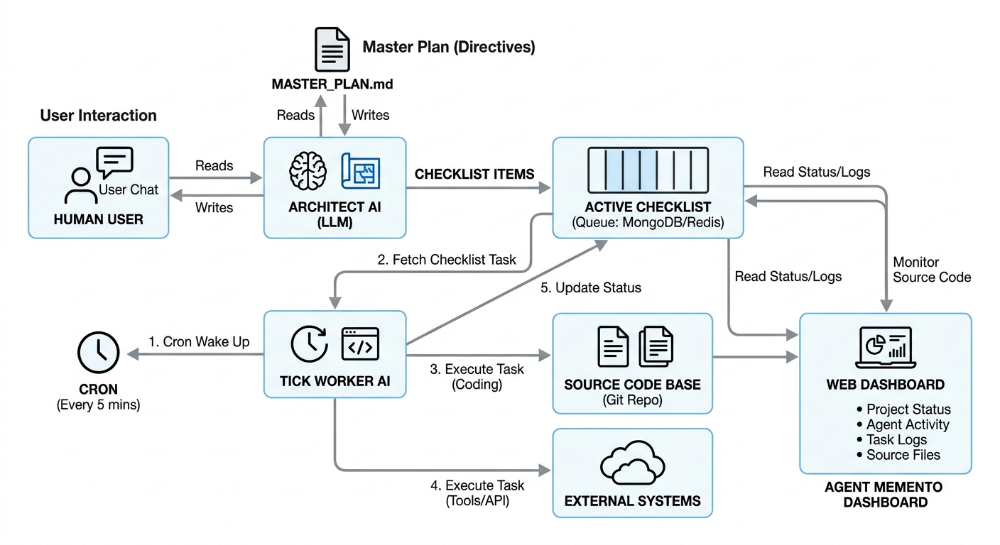

<div align="center">


# 🧠 Agent Memento

**面向大模型的“记碎式”自动化生产兵工厂**

*“让你的 AI 每 5 分钟强行失忆一次。这正是它的精髓。”*

[](https://github.com/openclaw/openclaw)
[](https://clawhub.com/yangwenyu2/agent-memento)
[](https://opensource.org/licenses/MIT)

[English](./README.md) | [简体中文](./README_zh.md)

</div>

这是一款基于时间跳动（Tick-driven）的自治生产框架，通过拥抱"失忆"，将容易发散的 LLM 从聊天机器人改造成可靠的流水线黑灯工厂。

> 灵感来自电影《记忆碎片》：如果你无法形成新的长期记忆，你必须把规矩和蓝图纹在身上。

> ⚠️ **安全与风险声明 (Security & Risk Warning)**:
> 本技能包含高权限的自动化工程能力，请仔细阅读：
> 1. **代码执行范围 (Arbitrary Execution)**: 核心引擎 (`memento_tick.sh`) 会不可控地在后台执行您在大纲中要求的代码生成与命令行构建（如 `verify` 测试）。请确保您的项目仅隔离在安全的虚拟机或容器内运行。
> 2. **回滚覆盖清理**: 当自动重试失败时引擎会执行 `git checkout -- .` 并自动 `git stash push -u` 收纳脏代码。这会将项目还原回上一保存点，如果不加注意可能引起刚手写的更改丢失。**绝对不要在已有重要文件的非独立目录中接入本框架**。
> 3. **HTTP 可选暴露**: 启动的监控台 Dashboard 支持将指定的项目目录挂载为静态网站 (`/preview`) 以供预览（需启用 `--enable-preview`）。开启时请确保您的项目内**不包含任何 API Keys 或私密文件**。


## 解决的痛点 (The Problem)

现在所有的写代码 Agent 最终都会撞上同一堵墙：

| 传统模式（Without Memento） | Memento 模式 (With Memento) |
|----------------|--------------|
| 🧠 “我能记住整个项目几千行的细节！” | 📋 “我只信文件。我每次醒来重新完整读一遍图纸。” |
| 💀 代码到了 2000 行后爆内存死锁 (OOM) | ✅ 靠无情切片能一个通宵糊出 1.5 万行甚至 10 万行项目 |
| 🎭 运行 30 分钟后产生幻觉重构代码 | 🔬 改动的每一行必须过本地命令审核与回滚防线 |
| 🔄 为了改个 bug 输出全量文件 | 🔪 纪律严明：只能用显微镜级的手术刀切入 |

## 它是怎么工作的？(How It Works)




1. **你** 在主群发一句自然语言：“我要爬昨天所有 AI 论文放到数据库”。
2. **架构师 (主 Agent Session)** 启动思考，把项目切成严丝合缝的 `[ ]` 检查清单任务。
3. **牛马机器们** 在系统的 cron 守护下，每 5 分钟醒一次。拿任务 `[ ]` -> 干活 -> 运行验证测试 -> 修改状态为 `[x]`。
4. 如果卡住 -> 标记为 `[!]` -> 发出警报，架构师去修 -> 流水线继续。
5. 你只需要泡杯茶，打开它的独立控制台 Dashboard 收菜。


## 核心功能特性 (Features)

*   **⚡️ Tick-Driven (时序脉冲驱动)**: 利用后台 `cron` 或循环脚本进行低频轮询，唤醒短寿但精英的 Tick Worker 进行切片开发。
*   **🛡️ Iron Discipline (铁血防爆机制)**: 每次 Tick 修改代码后必须强制运行 `verify` 命令。Exit 0 记功，非 0 则强制触发 `git checkout` 与 `git clean` 三阶段回滚，绝不让脏代码污染主分支。
*   **🎨 Staff-Level Craftsmanship (高级产品审美)**: 内置严苛的 System Prompt 洗脑，强制要求模型产出带有现代 UI 质感（毛玻璃、动画、响应式、高级光影）的生产级代码，彻底告别丑陋的“色块/线框” PoC 废渣。
*   **📺 Holographic Dashboard (全息监工看板)**: 随机附赠一个极为赛博硬核的网页外接监视器：
    *   **▶ Live Preview (实时预览)**: 一键沉浸式挂载当前正在生成的 HTML5/Web 项目，边看进度条边玩生成的游戏/页面。
    *   **📊 动态进度光条**: 基于 Markdown 真实 `[x]` 任务勾选数量进行毫秒级雷达校准匹配的 100% 同步进度条。
    *   **💬 观察者控制台**: 可以在面板通过聊天框直接命令看门 Agent 宣读当前工程的最新里程碑和架构现状。
*   **🌏 Native Bilingual (双语自适应)**: 无缝自适应中文/英文工程生态。只要你的 `MASTER_PLAN.md` 定调是中文，所有的日志、git commit 和代码注释都会强制输出纯正中文。

## 30 秒上手 (Quick Start)

1. 初始化一套防爆的工程系统脚手架：
   ```bash
   bash skills/agent-memento/scripts/init_memento.sh MyProject
   ```

2. 让主对话里的 Architect 填好 `docs/MASTER_PLAN.md` 和 `docs/PROJECT_MAP.md`。

3. 将脉冲挂上机器系统：
   ```bash
   crontab -e
   # 加入：*/5 * * * * /path/to/MyProject/scripts/memento_tick.sh
   ```

4. 拉起实时的外接监测控制台（Dashboard）：
   ```bash
   bash skills/agent-memento/scripts/dashboard.sh
   ```

## 哲学 (Philosophy)

> "最顶级的 AI 系统，就是假设它根本什么都记不住，然后围绕这个残酷的前提搭建世界。"

Agent Memento 并不能让现在的模型变得更聪明。但它能让 AI 变得完全 **可靠 (Reliable)** ——通过给它一本永远丢不掉的物理记事本（MASTER_PLAN），要求它每次操作后的铁血三阶自证防污染清理，以及一次次把它每 5 分钟杀死并重生的纪律。

---
阅读 [SKILL.md](./SKILL.md) 了解完整的底层工作流与系统预注入 prompt。
